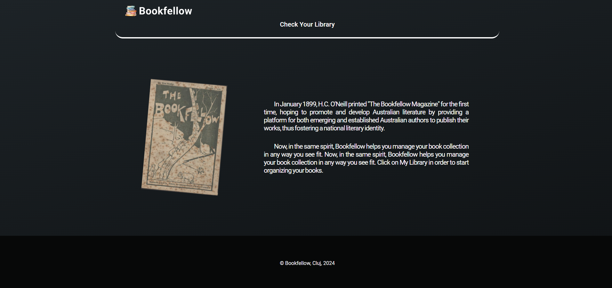

# Bookfellow App

Client application that allows you manage your book collection.

## Available Scripts

In the project directory, you can run:

### `npm start`

Runs the app in the development mode.\
Open [http://localhost:3000](http://localhost:3000) to view it in the browser.

The page will reload if you make edits.\
You will also see any lint errors in the console.

### `npm run build`

Builds the app for production to the `build` folder.\
It correctly bundles React in production mode and optimizes the build for the best performance.

## Short User Manual

The Bookfellow application has two pages: 
- **Home Page** page, that explains the brand and ca be found on [http://localhost:3000](http://localhost:3000). From this page, the user can access the **Library Page** page by clicking the **Check Your Library** link from the header.

- **Library** page, that provides the management part of the book collection. 

  - Here the user can 
    - **Delete** a book by clicking on the *trash* button 
    - **Modify** the details of a  book by clicking on the *pen* button 
  
  
  
    - **Add a new book** by clicking on the *Add New Book* button  and then 
  
  
    - **See Details** of a book by clicking on the book card.
  
  

## Static Texts

All the client application texts are comming from `src/assets/static/text/static-text.json` and should be moved in a DB that can provide/store the necessary translations text.